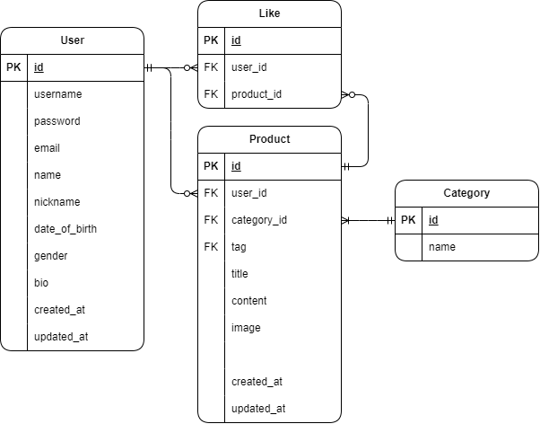

# spartamarket-drf
Django REST Framework를 사용하여 spartamarket 재구성

## 주요 기능
- 사용자 인증 (회원가입, 로그인, 로그아웃)
- 사용자 프로필 관리
- 상품 등록, 조회, 수정, 삭제 기능(CRUD)
- 사용자 간 팔로우 기능
- 상품 좋아요 기능
- 상품 태그 기능

## ERD

## API 명세

## 필수 구현

### 사용자 인증
#### 1. 회원가입
- **Endpoint**: `/api/accounts`
- **Method**: `POST`
- **조건**: `username`, `password`, `email`, `first_name`, `last_name`, `nickname`, `date_of_birth` 필수 입력, `gender`, `bio`는 선택 입력
- **검증**: 
  - `username`과 `email`은 유일해야 함
  - `password_check`로 비밀번호 일치 여부 검증
- **응답**: 
  - 성공 시: 생성된 사용자 정보 반환
  - 실패 시: 오류 메시지 반환

#### 2. 로그인
- **Endpoint**: `/api/accounts/login`
- **Method**: `POST`
- **조건**: `username`, `password` 입력 필수
- **검증**: 
  - `username`과 `password`가 데이터베이스와 일치해야 함
- **응답**: 
  - 성공 시: JWT 토큰 (`access_token`, `refresh_token`) 발급
  - 실패 시: 오류 메시지 반환

#### 3. 프로필 조회
- **Endpoint**: `/api/accounts/<str:username>/profile/`
- **Method**: `GET`
- **조건**: 로그인 상태 필요
- **검증**: 로그인한 사용자만 자신의 프로필 조회 가능
- **응답**: 
  - 성공 시: 사용자의 정보를 JSON 형태로 반환
  - 실패 시: 오류 메시지 반환

---

### **상품 관련 기능 및 조건 (상품 등록 / 상품 목록 조회 / 상품 수정 / 상품 삭제)**

#### 1. 상품 등록
- **Endpoint**: `/api/products`
- **Method**: `POST`
- **조건**: 로그인 상태 필요, 제목, 내용, 상품 이미지 필수
- **응답**: 새 상품을 데이터베이스에 저장

#### 2. 상품 목록 조회
- **Endpoint**: `/api/products`
- **Method**: `GET`
- **조건**: 로그인 불필요
- **응답**: 모든 상품 목록을 페이지네이션하여 반환

#### 3. 상품 수정
- **Endpoint**: `/api/products/<int:productId>`
- **Method**: `PUT`
- **조건**: 로그인 상태, 게시글 작성자만 수정 가능
- **검증**: 요청자가 게시글 작성자인지 확인
- **응답**: 수정된 정보로 기존 상품 정보를 업데이트

#### 4. 상품 삭제
- **Endpoint**: `/api/products/<int:productId>`
- **Method**: `DELETE`
- **조건**: 로그인 상태, 삭제 권한은 게시글 작성자에게만 부여
- **검증**: 요청자가 게시글 작성자인지 확인
- **응답**: 해당 상품을 데이터베이스에서 삭제

---

## 선택 구현 (Optional)

#### 1. 로그아웃
- **Endpoint**: `/api/accounts/logout`
- **Method**: `POST`
- **조건**: 로그인 상태 필요
- **구현**: `refresh_token`을 블랙리스트에 추가하여 로그아웃 처리
- **응답**: 성공 시 상태 코드 200

#### 2. 본인 정보 수정
- **Endpoint**: `/api/accounts/<str:username>/update/`
- **Method**: `PUT`
- **조건**: 로그인 상태, `email`, `first_name`, `last_name`, `nickname`, `date_of_birth` 필수, `gender`, `bio`는 선택
- **검증**: 로그인한 사용자만 본인 프로필 수정 가능
- **응답**: 성공 시 업데이트된 정보 반환

#### 3. 비밀번호 변경
- **Endpoint**: `/api/accounts/password`
- **Method**: `PUT`
- **조건**: 기존 비밀번호와 새 비밀번호는 일치하지 않아야 함
- **응답**: 성공 시 상태 코드 200

#### 4. 회원 탈퇴
- **Endpoint**: `/api/accounts`
- **Method**: `DELETE`
- **조건**: 로그인 상태, 비밀번호 재입력 필요
- **검증**: 입력된 비밀번호가 기존 비밀번호와 일치해야 함
- **응답**: 성공 시 계정 삭제

---

### 상품 관련 기능 및 조건 

#### **페이지네이션 및 필터링 (검색기능)**
- **조건**: 상품 목록 조회 시 적용됩니다.
- **구현**: 
  - `title`(제목), `username`(유저명), `content`(내용)으로 필터링이 가능
  - 결과는 페이지네이션으로 관리
- **Endpoint**: `/api/products`
- **Method**: `GET`
- **설명**: 필터링 조건을 추가하여 검색 가능하며, 페이지네이션을 통해 결과를 반환

#### **카테고리 기능**
- **조건**: 
  - `admin` 계정만 카테고리 생성 가능
  - 일반 사용자 및 로그인 유저는 상품 등록 시 카테고리를 선택하여 연결 가능
- **구현**: 
  - 카테고리명은 고유해야 함
  - 상품과 카테고리 간의 관계는 데이터베이스에 저장
- **Endpoint**: `/api/categories`
- **Method**: `POST` (admin 계정), `GET` (일반 사용자)
- **설명**: 상품 등록 시 카테고리 선택 가능, 관리자는 카테고리 생성 및 관리 가능

---

## 추가 기능

#### 1. 팔로우 기능
- 사용자 간의 **ManyToMany** 관계를 통해 팔로우 기능 구현

#### 2. 좋아요 기능
- 상품에 좋아요 추가 가능
- 필터링(좋아요 순) 기능 추가

#### 3. 태그 기능
- 모든 태그는 **고유**해야 하며, 태그를 통한 상품 필터링 가능

---

